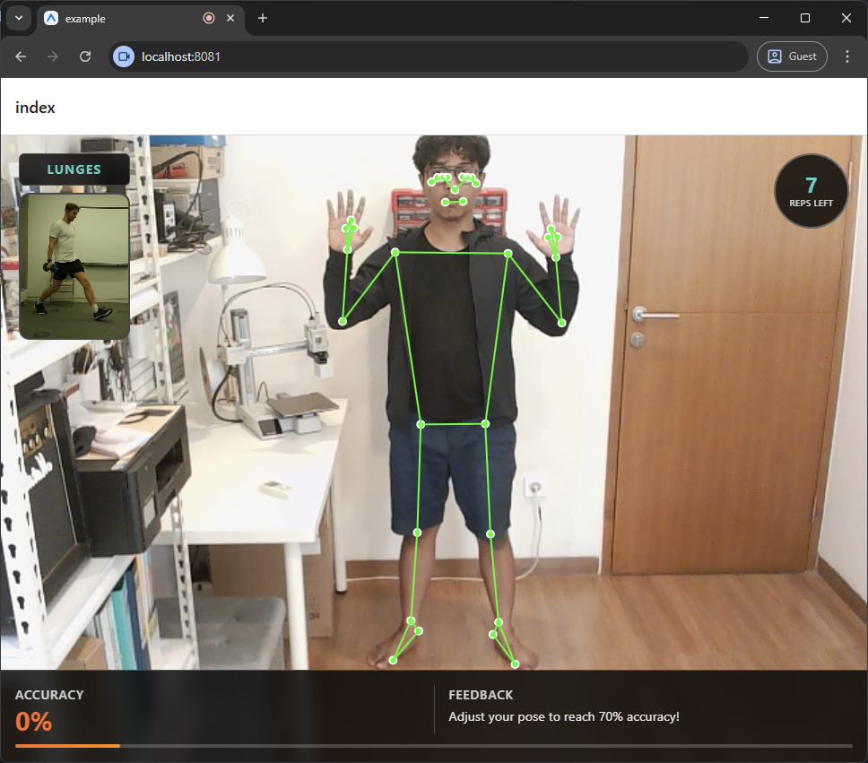
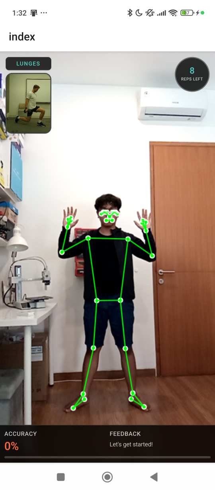
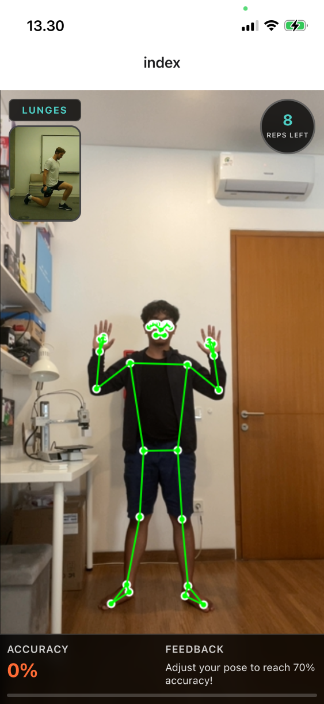

# gymsense-rn

XLabs GymSense multiplatform library.

## Installation

```sh
npm install gymsense-rn expo-speech
```

**Note:** `expo-speech` is required for native text-to-speech support in the embedded web application.

## Usage

### Exercise Component

Use the `Exercise` component to execute exercises with a specific exercise ID and target.

```ts
import { View, Platform, StyleSheet } from 'react-native';
import { Exercise } from 'gymsense-rn';
import type { SessionCompletePayload, SetCompletePayload } from 'gymsense-rn';

export default function Index() {
  return (
    <View style={styles.safeArea}>
      <Exercise
        token="your_token_here"
        exerciseId={12}
        target={10}
        sets={3}
        restDuration={45}
        bodyWeight={70}
        theme="light"
        onSetComplete={(result: SetCompletePayload) => {
          console.log("Set Completed");
          console.log("Set Number:", result.setNumber);
          console.log("Count:", result.count);
          console.log("Accuracy:", result.accuracy);
          console.log("Duration:", result.duration);
        }}
        onSessionComplete={(result: SessionCompletePayload) => {
          console.log("Exercise Session Completed");
          console.log("Exercise ID:", result.exerciseId);
          console.log("Exercise Name:", result.exerciseName);
          console.log("Type:", result.type);
          console.log("Total Sets:", result.totalSets);
          console.log("Sets Data:", result.sets);
          console.log("Total Count:", result.count);
          console.log("Average Accuracy:", result.accuracy);
          console.log("Calories Burned:", result.calories);
        }}
        onSessionCanceled={() => {
          console.log("Exercise Session Canceled");
        }}
        debug={false}
      />
    </View>
  );
}

const styles = StyleSheet.create({
  safeArea: {
    flex: 1,
    backgroundColor: "transparent",
    paddingBottom: Platform.OS === 'android' ? 50 : 0,
  },
});
```

### RecordExercise Component

Use the `RecordExercise` component to create new exercises.

```ts
import { View, Platform, StyleSheet } from 'react-native';
import { RecordExercise } from 'gymsense-rn';
import type { ExerciseCreatedPayload } from 'gymsense-rn';

export default function Index() {
  return (
    <View style={styles.safeArea}>
      <RecordExercise
        token="your_token_here"
        authorId={123}
        authorName="John Doe"
        theme="light"
        onExerciseCreated={(result: ExerciseCreatedPayload) => {
          console.log("Exercise Created");
          console.log("Exercise ID:", result.exerciseId);
          console.log("Exercise Name:", result.exerciseName);
          console.log("Exercise Type:", result.exerciseType);
          console.log("Author ID:", result.authorId);
          console.log("Author Name:", result.authorName);
          console.log("Video URL:", result.videoUrl);
          console.log("Icon URL:", result.iconUrl);
          console.log("Created At:", result.createdAt);
        }}
        debug={false}
      />
    </View>
  );
}

const styles = StyleSheet.create({
  safeArea: {
    flex: 1,
    backgroundColor: "transparent",
    paddingBottom: Platform.OS === 'android' ? 50 : 0,
  },
});
```

### EditExercise Component

Use the `EditExercise` component to edit existing exercises.

```ts
import { View, Platform, StyleSheet } from 'react-native';
import { EditExercise } from 'gymsense-rn';
import type { ExerciseUpdatedPayload } from 'gymsense-rn';

export default function Index() {
  return (
    <View style={styles.safeArea}>
      <EditExercise
        token="your_token_here"
        exerciseId={123}
        theme="light"
        onExerciseUpdated={(result: ExerciseUpdatedPayload) => {
          console.log("Exercise Updated");
          console.log("Exercise ID:", result.exerciseId);
          console.log("Exercise Name:", result.exerciseName);
          console.log("Exercise Type:", result.exerciseType);
          console.log("Author ID:", result.authorId);
          console.log("Author Name:", result.authorName);
          console.log("Video URL:", result.videoUrl);
          console.log("Icon URL:", result.iconUrl);
          console.log("Updated At:", result.updatedAt);
        }}
        debug={false}
      />
    </View>
  );
}

const styles = StyleSheet.create({
  safeArea: {
    flex: 1,
    backgroundColor: "transparent",
    paddingBottom: Platform.OS === 'android' ? 50 : 0,
  },
});
```

## Component Props

### Exercise

| Prop                | Type                                       | Required | Description                                           |
| ------------------- | ------------------------------------------ | -------- | ----------------------------------------------------- |
| `token`             | `string`                                   | Yes      | Authentication token                                  |
| `exerciseId`        | `number`                                   | Yes      | ID of the exercise to execute                         |
| `target`            | `number`                                   | Yes      | Target repetitions or duration per set                |
| `sets`              | `number`                                   | No       | Number of sets to perform (default: `1`)              |
| `restDuration`      | `number`                                   | No       | Rest duration between sets in seconds (default: `30`) |
| `bodyWeight`        | `number`                                   | No       | User's body weight in kg (optional)                   |
| `theme`             | `'light' \| 'dark'`                        | No       | UI theme (default: `'light'`)                         |
| `onSetComplete`     | `(result: SetCompletePayload) => void`     | No       | Callback when each set completes                      |
| `onSessionComplete` | `(result: SessionCompletePayload) => void` | No       | Callback when entire session completes                |
| `onSessionCanceled` | `() => void`                               | No       | Callback when session is canceled                     |
| `debug`             | `boolean`                                  | No       | Enable debug mode (default: `false`)                  |

### RecordExercise

| Prop                | Type                                       | Required | Description                          |
| ------------------- | ------------------------------------------ | -------- | ------------------------------------ |
| `token`             | `string`                                   | Yes      | Authentication token                 |
| `authorId`          | `number`                                   | Yes      | ID of the exercise author            |
| `authorName`        | `string`                                   | Yes      | Name of the exercise author          |
| `theme`             | `'light' \| 'dark'`                        | No       | UI theme (default: `'light'`)        |
| `onExerciseCreated` | `(result: ExerciseCreatedPayload) => void` | No       | Callback when exercise is created    |
| `debug`             | `boolean`                                  | No       | Enable debug mode (default: `false`) |

### EditExercise

| Prop                | Type                                       | Required | Description                          |
| ------------------- | ------------------------------------------ | -------- | ------------------------------------ |
| `token`             | `string`                                   | Yes      | Authentication token                 |
| `exerciseId`        | `number`                                   | Yes      | ID of the exercise to edit           |
| `theme`             | `'light' \| 'dark'`                        | No       | UI theme (default: `'light'`)        |
| `onExerciseUpdated` | `(result: ExerciseUpdatedPayload) => void` | No       | Callback when exercise is updated    |
| `debug`             | `boolean`                                  | No       | Enable debug mode (default: `false`) |

## Message Payloads

### SetCompletePayload

Triggered when each individual set is completed.

```ts
{
  setNumber: number;   // Set number (1-indexed)
  count: number;       // Reps completed or seconds held
  accuracy: number;    // Score (0-100)
  rom?: number;        // Range of Motion (if exerciseType is 'repetition')
  stability?: number;  // Stability score (if exerciseType is 'hold')
  duration: number;    // Duration of the set in seconds
  target: number;      // The target count for this set
}
```

### SessionCompletePayload

Triggered when the entire exercise session is completed (all sets finished).

```ts
{
  start: number;                 // Start timestamp (Unix seconds)
  end: number;                   // End timestamp (Unix seconds)
  duration: number;              // Total session duration in seconds
  exerciseId: number;            // ID of the exercise
  exerciseName: string;          // Name of the exercise
  type: "repetition" | "hold";   // Exercise type
  totalSets: number;             // Total number of sets configured
  sets: SetCompletePayload[];    // Array of data for each completed set
  count: number;                 // Total reps/seconds across all sets
  accuracy: number;              // Average accuracy across all sets
  rom?: number;                  // Average ROM (if applicable)
  stability?: number;            // Average Stability (if applicable)
  calories?: number;             // Estimated calories burned during the session (if applicable)
}
```

### ExerciseCreatedPayload

```ts
{
  exerciseId: number; // Database ID of the newly created exercise
  exerciseName: string; // Name of the exercise
  exerciseType: 'repetition' | 'hold'; // Exercise type
  authorId: string; // ID of the author/trainer
  authorName: string; // Name of the author/trainer
  videoUrl: string; // URL to the reference video
  iconUrl: string; // URL to the exercise icon
  createdAt: string; // ISO timestamp of creation
}
```

### ExerciseUpdatedPayload

```ts
{
  exerciseId: number; // Database ID of the updated exercise
  exerciseName: string; // Name of the exercise
  exerciseType: 'repetition' | 'hold'; // Exercise type
  authorId: string; // ID of the author/trainer
  authorName: string; // Name of the author/trainer
  videoUrl: string; // URL to the reference video
  iconUrl: string; // URL to the exercise icon
  updatedAt: string; // ISO timestamp of update
}
```

## Screenshots

### Web



### Native

<div style="display: flex; gap: 10px; align-items: flex-start;">
  
  
</div>

## Features

### Native Text-to-Speech Bridge

The library includes a native TTS bridge that enables the embedded web application to use text-to-speech on mobile devices. The Web Speech API (`SpeechSynthesisUtterance`) is automatically polyfilled and routed to the device's native TTS engine via `expo-speech`.

**Benefits:**

- ✅ Works on iOS and Android (where Web Speech API is not supported in WebViews)
- ✅ No changes required in the web application code
- ✅ Uses native device voices for better quality
- ✅ Supports multiple languages and voice customization

For detailed information, see [TTS_BRIDGE_GUIDE.md](TTS_BRIDGE_GUIDE.md).

## License

MIT

---

Made with [create-react-native-library](https://github.com/callstack/react-native-builder-bob)
